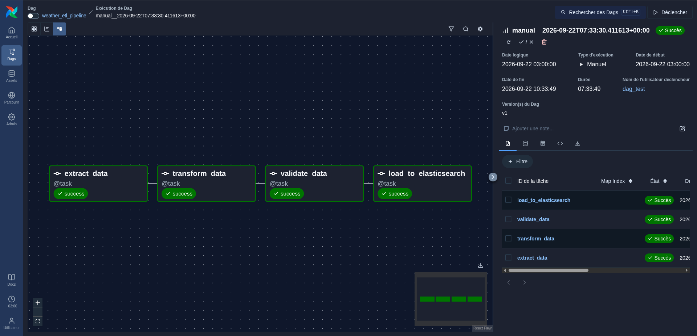
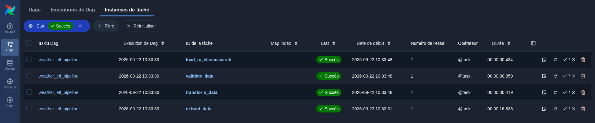
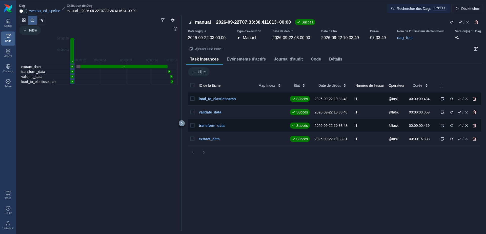
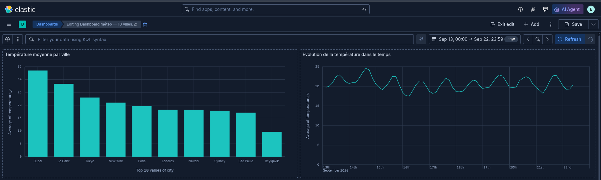
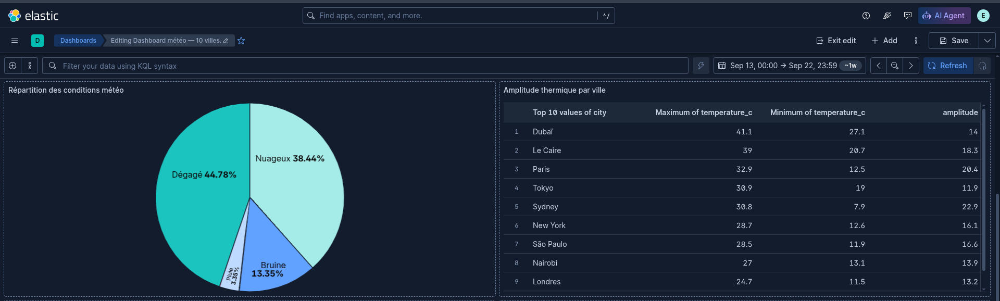
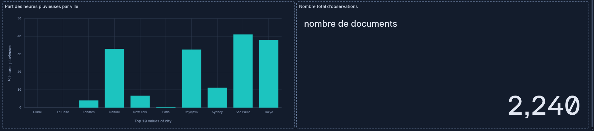

# Pipeline ETL météo — Airflow, Elasticsearch, Kibana

Pipeline de Data Engineering complet : collecte automatisée de données météo réelles, nettoyage, contrôle qualité, indexation dans Elasticsearch et visualisation dans Kibana, le tout orchestré par Apache Airflow.

Projet réalisé dans le cadre du Master 1 Informatique, spécialité IA & Big Data.

---

## Sommaire

1. [Présentation du projet](#1-présentation-du-projet)
2. [Contexte](#2-contexte)
3. [Objectifs](#3-objectifs)
4. [Architecture](#4-architecture)
5. [Technologies](#5-technologies)
6. [Source des données](#6-source-des-données)
7. [Structure du projet](#7-structure-du-projet)
8. [Installation](#8-installation)
9. [Configuration](#9-configuration)
10. [Lancement](#10-lancement)
11. [Pipeline ETL](#11-pipeline-etl)
12. [Transformations](#12-transformations-appliquées)
13. [Validation](#13-validation-contrôle-qualité)
14. [Elasticsearch](#14-elasticsearch)
15. [Analyses](#15-analyses)
16. [Kibana](#16-kibana)
17. [Dashboard](#17-dashboard)
18. [Résultats](#18-résultats)
19. [Captures d'écran](#19-captures-décran)
20. [Difficultés rencontrées](#20-difficultés-rencontrées)
21. [Améliorations possibles](#21-améliorations-possibles)
22. [Checklist finale de vérification](#22-checklist-finale-de-vérification) *(bonus)*
23. [Glossaire Airflow](#23-glossaire-airflow) *(bonus)*

---

## 1. Présentation du projet

Ce projet construit, de bout en bout, une chaîne de traitement de données automatisée :

```
Collecter → Transformer → Contrôler → Charger → Analyser → Visualiser
```

Il couvre, dans l'ordre, l'extraction de données depuis une API publique, leur nettoyage avec pandas, un contrôle de qualité qui peut bloquer la chaîne en cas de problème, leur indexation dans Elasticsearch, puis leur exploration à travers un dashboard Kibana. L'ensemble est planifié et surveillé par Apache Airflow, avec gestion des erreurs, tentatives automatiques et journalisation.

Le domaine choisi est la **météo et l'environnement**, avec des données réelles (pas simulées) pour 10 villes réparties sur les 5 continents habités, ce qui permet des comparaisons géographiques et climatiques intéressantes (hémisphères, latitudes, désert vs océan).

## 2. Contexte

Le sujet demande de simuler la mise en place, pour une entreprise, d'une plateforme de collecte, transformation, analyse et visualisation de données, avec Apache Airflow comme chef d'orchestre et Elasticsearch/Kibana comme couche de stockage et de restitution. Le projet devait rester **simple, fonctionnel, automatisé et reproductible**, plutôt que de chercher une complexité inutile — c'est le fil conducteur de tous les choix techniques documentés ci-dessous.

## 3. Objectifs

À l'issue du projet, la chaîne complète permet de :

1. Récupérer automatiquement des données météo horaires, sans intervention manuelle.
2. Nettoyer et transformer ces données (types, dates, doublons, valeurs manquantes, enrichissements).
3. Contrôler leur qualité avant tout chargement, avec échec explicite en cas de problème.
4. Charger les données dans un index Elasticsearch structuré (mapping explicite).
5. Orchestrer l'ensemble avec un DAG Airflow planifié, avec retries, logs et dépendances entre tâches.
6. Produire des indicateurs répondant à de vraies questions métier.
7. Construire un dashboard Kibana avec au moins 4 visualisations différentes (6 ont été réalisées ici).

## 4. Architecture

### Vue d'ensemble

```
                    API Open-Meteo (JSON, sans clé)
                                │
                                ▼
                 ┌──────────────────────────────┐
                 │   Airflow DAG (@daily, UTC)   │
                 └──────────────────────────────┘
                                │
   ┌────────────────┬──────────────────┬─────────────────────┬──────────────────────────┐
   ▼                 ▼                  ▼                     ▼                          
extract_data → transform_data → validate_data → load_to_elasticsearch
(requests)      (pandas)          (contrôles)      (elasticsearch-py, bulk API)
   │                 │                  │                     │
   ▼                 ▼                  ▼                     ▼
data/raw/*.json  data/processed/*.csv  quality_report_*.json  index "weather-observations"
                                                                        │
                                                                        ▼
                                                              Kibana (Lens, Dashboard)
```

### Rôle de chaque composant

- **API Open-Meteo** : source unique de vérité pour les données brutes. Gratuite, sans authentification, ce qui simplifie la reproductibilité (personne n'a besoin de créer un compte pour cloner et faire tourner le projet).
- **Airflow** : ne contient aucune logique métier lui-même. Son rôle est d'appeler, dans l'ordre, les fonctions définies dans `scripts/`, de gérer les échecs (retries), de transmettre de petites informations d'une tâche à l'autre (XCom) et de fournir des logs et un historique d'exécution.
- **Scripts Python (`scripts/`)** : contiennent toute la logique métier, complètement indépendants d'Airflow. Chaque script s'exécute seul en ligne de commande (`python scripts/extract.py`, etc.), ce qui a permis de les tester unitairement avant même d'écrire le DAG.
- **Elasticsearch** : moteur de recherche et d'agrégation de documents JSON. Choisi ici pour sa capacité à faire des agrégations rapides (moyennes, group-by, séries temporelles) sur des dizaines de milliers de documents, exactement ce dont Kibana a besoin.
- **Kibana** : interface de visualisation posée directement sur Elasticsearch, sans base de données intermédiaire.

### Pourquoi cette architecture plutôt qu'une autre

Les scripts sont volontairement découplés du DAG (`dags/etl_pipeline.py` importe les fonctions de `scripts/`, il ne contient pas la logique lui-même). Cela permet de :
- tester chaque étape isolément en ligne de commande, sans lancer Airflow ;
- réutiliser les mêmes fonctions dans un notebook, un test unitaire, ou un autre orchestrateur si besoin ;
- garder le fichier de DAG court et lisible, ce qu'Airflow apprécie puisqu'il le réanalyse en continu.

## 5. Technologies

| Composant | Technologie | Version | Rôle |
|---|---|---|---|
| Orchestration | Apache Airflow | 3.3.1 | Planification, dépendances, retries, logs |
| Extraction | Python + `requests` | — | Appels HTTP vers l'API Open-Meteo |
| Transformation | Python + `pandas` | 3.0.5 | Nettoyage, enrichissement tabulaire |
| Stockage / recherche | Elasticsearch | 9.5.2 | Indexation, agrégations |
| Client Elasticsearch | `elasticsearch` (Python) | 9.5.0 | Communication avec le cluster |
| Visualisation | Kibana | 9.5.2 | Dashboard, éditeur Lens |
| Conteneurisation | Docker / Docker Compose | — | Déploiement reproductible (optionnel) |
| Langage | Python | 3.12 | Tous les scripts |
| Versionnement | Git / GitHub | — | Suivi du code, collaboration |

## 6. Source des données

### API

[Open-Meteo](https://open-meteo.com/) — API météo gratuite, sans inscription ni clé, avec un historique et des prévisions horaires. Endpoint utilisé : `https://api.open-meteo.com/v1/forecast`.

### Paramètres d'appel

| Paramètre | Valeur | Rôle |
|---|---|---|
| `latitude`, `longitude` | selon la ville | Localisation du point de mesure |
| `hourly` | 5 variables (voir ci-dessous) | Variables horaires demandées |
| `past_days` | 7 | Historique récent |
| `forecast_days` | 1 | Journée en cours (heures déjà passées uniquement, filtrées ensuite) |
| `timezone` | `GMT` | Toutes les heures en UTC, pour éviter toute ambiguïté de fuseau |

### Villes suivies

| Ville | Pays | Continent | Latitude | Longitude |
|---|---|---|---|---|
| Paris | France | Europe | 48.8566 | 2.3522 |
| Londres | Royaume-Uni | Europe | 51.5074 | -0.1278 |
| Reykjavik | Islande | Europe | 64.1466 | -21.9426 |
| New York | États-Unis | Amérique | 40.7128 | -74.0060 |
| São Paulo | Brésil | Amérique | -23.5505 | -46.6333 |
| Tokyo | Japon | Asie | 35.6762 | 139.6503 |
| Dubaï | Émirats arabes unis | Asie | 25.2048 | 55.2708 |
| Le Caire | Égypte | Afrique | 30.0444 | 31.2357 |
| Nairobi | Kenya | Afrique | -1.2921 | 36.8219 |
| Sydney | Australie | Océanie | -33.8688 | 151.2093 |

Cette liste est modifiable directement dans `scripts/extract.py` (constante `CITIES`) : le reste du pipeline s'adapte automatiquement au nombre de villes.

### Variables brutes récupérées

| Champ API | Unité | Description |
|---|---|---|
| `temperature_2m` | °C | Température à 2 m du sol |
| `relative_humidity_2m` | % | Humidité relative |
| `precipitation` | mm | Précipitations sur l'heure |
| `wind_speed_10m` | km/h | Vitesse du vent à 10 m |
| `weather_code` | code WMO | Code météo standardisé (0 = ciel dégagé, 61 = pluie...) |

## 7. Structure du projet

```
projet-data-engineering/
│
├── dags/
│   └── etl_pipeline.py        # DAG Airflow : orchestration des 4 tâches (TaskFlow API)
│
├── scripts/
│   ├── __init__.py
│   ├── extract.py             # Appelle l'API Open-Meteo, sauvegarde le JSON brut
│   ├── transform.py           # Nettoie et enrichit les données (pandas), produit un CSV
│   ├── validate.py            # 6 contrôles qualité, produit un rapport JSON
│   └── load.py                # Connexion Elasticsearch, création d'index, chargement bulk
│
├── data/                      # Données générées à l'exécution (non versionnées)
│   ├── raw/                   #   JSON bruts, un fichier par jour d'extraction
│   └── processed/              #   CSV propres + rapports de qualité
│
├── elasticsearch/
│   ├── mapping.json           # Définition des champs et de leurs types
│   └── queries.json           # 6 requêtes d'agrégation (indicateurs métier)
│
├── kibana/
│   └── dashboard.ndjson       # Export du dashboard et de ses 6 visualisations
│
├── docs/
│   └── screenshots/           # Captures d'écran utilisées dans ce README
│
├── secrets/                   # Certificat CA local (non versionné)
├── docker-compose.yml         # Pile Elasticsearch + Kibana conteneurisée (optionnelle)
├── requirements.txt           # Dépendances Python, avec fichier de contraintes Airflow
├── .env.example                # Modèle de configuration, sans aucun secret réel
├── .gitignore
└── README.md                  # Ce fichier
```

## 8. Installation

### Prérequis

- **Python 3.12**
- Un environnement **Apache Airflow 3.3.1** (`apache-airflow==3.3.1`), existant ou à créer dans un `venv` dédié
- **Git**
- **Elasticsearch et Kibana 9.x** — en installation native, ou via Docker/Docker Compose
- **Docker et Docker Compose** (optionnel, uniquement si tu choisis la pile conteneurisée)

### Vérifier l'environnement avant d'installer quoi que ce soit

```bash
python3 --version
git --version
docker --version && docker compose version   # si tu comptes utiliser Docker
curl -s -o /dev/null -w "%{http_code}\n" https://api.open-meteo.com/v1/forecast   # doit répondre 200/400
```

### Cloner le dépôt

```bash
git clone https://github.com/lepiso/projet-data-engineering.git
cd projet-data-engineering
```

### Installer les dépendances Python

Dans le venv Airflow existant (ou nouvellement créé avec `python3.12 -m venv mon-venv`) :

```bash
source /chemin/vers/ton/venv-airflow/bin/activate
pip install -r requirements.txt \
  --constraint "https://raw.githubusercontent.com/apache/airflow/constraints-3.3.1/constraints-3.12.txt"
```

Le fichier de contraintes fige les versions compatibles entre Airflow, pandas, le client Elasticsearch et leurs dépendances communes — sans lui, `pip` pourrait installer une version qui casse Airflow. `requirements.txt` fixe explicitement `apache-airflow==3.3.1` pour empêcher toute mise à jour accidentelle.

**Vérification :**
```bash
pip check
airflow version                 # doit afficher 3.3.1
python -c "import pandas, elasticsearch; print(pandas.__version__, elasticsearch.__version__)"
```

## 9. Configuration

### Fichier `.env`

```bash
cp .env.example .env
```

| Variable | Rôle | Utilisée par |
|---|---|---|
| `ES_HOST`, `ES_PORT`, `ES_SCHEME` | Adresse d'Elasticsearch | `scripts/load.py` en test manuel |
| `ES_USER`, `ES_PASSWORD` | Identifiants d'un utilisateur Elasticsearch dédié (voir §14) | `scripts/load.py` en test manuel |
| `ES_CA_CERTS` | Chemin absolu vers le certificat CA d'Elasticsearch | `scripts/load.py` en test manuel |
| `ELASTIC_PASSWORD` | Mot de passe du compte `elastic` | `docker-compose.yml` uniquement |
| `KIBANA_PASSWORD` | Mot de passe du compte `kibana_system` | `docker-compose.yml` uniquement |

`.env` **n'est jamais versionné** (voir `.gitignore`) : chaque personne qui clone le dépôt doit créer le sien avec ses propres valeurs. En production, `load_to_elasticsearch` n'utilise pas ce fichier mais une **Connection Airflow** (voir §11), plus sûre.

### Certificat Elasticsearch

Si tu installes Elasticsearch nativement (RPM/APT), la sécurité (HTTPS + authentification) est activée par défaut. Le certificat auto-signé du serveur doit être copié localement pour que le client Python lui fasse confiance :

```bash
mkdir -p secrets
sudo cp /etc/elasticsearch/certs/http_ca.crt secrets/http_ca.crt
sudo chown "$USER": secrets/http_ca.crt
```

`secrets/` est ignoré par Git — ce certificat reste local à chaque installation.

## 10. Lancement

### Option A — Elasticsearch et Kibana installés nativement

```bash
sudo systemctl start elasticsearch
# Attendre qu'Elasticsearch réponde (jusqu'à 60 s) :
until [ "$(curl -sk -m 3 -o /dev/null -w '%{http_code}' https://localhost:9200)" = "401" ]; do sleep 3; done
sudo systemctl start kibana
sleep 30
```

Kibana écoute en **HTTP simple** sur `http://localhost:5601` (Elasticsearch, lui, est en HTTPS).

### Option B — Elasticsearch et Kibana via Docker Compose

```bash
docker compose up -d
docker compose ps       # attendre que les 3 services soient "healthy"
```

Kibana est alors accessible sur `http://localhost:5601`, avec les identifiants `ELASTIC_PASSWORD` / `KIBANA_PASSWORD` du `.env`.

⚠️ **Ne jamais lancer les deux options en même temps** : elles utilisent les mêmes ports (9200, 5601) et entreraient en conflit.

### Créer l'utilisateur Elasticsearch dédié au pipeline (une seule fois)

```bash
curl --cacert secrets/http_ca.crt -u elastic -X PUT "https://localhost:9200/_security/role/weather_pipeline" \
  -H "Content-Type: application/json" \
  -d '{"cluster":["monitor"],"indices":[{"names":["weather-*"],"privileges":["all"]}]}'

curl --cacert secrets/http_ca.crt -u elastic -X PUT "https://localhost:9200/_security/user/airflow_weather" \
  -H "Content-Type: application/json" \
  -d '{"password":"<choisis_un_mot_de_passe>","roles":["weather_pipeline"],"full_name":"Pipeline Airflow météo"}'
```

Ce rôle limite `airflow_weather` aux index `weather-*` : le principe du moindre privilège.

### Préparer et lancer Airflow

```bash
export AIRFLOW_HOME=/chemin/vers/airflow_home
ln -sfn "$(pwd)/dags" "$AIRFLOW_HOME/dags"
airflow db migrate
airflow dags reserialize        # force un premier scan du DAG (sans scheduler)

airflow connections add elasticsearch_weather \
  --conn-type generic --conn-host localhost --conn-port 9200 --conn-schema https \
  --conn-login airflow_weather --conn-password '<le_mot_de_passe_choisi>' \
  --conn-extra '{"ca_certs": "'"$(pwd)"'/secrets/http_ca.crt", "verify_certs": "true"}'

airflow dags test weather_etl_pipeline $(date +%Y-%m-%d)
```

`airflow dags test` exécute les 4 tâches en séquence, dans le terminal, sans nécessiter de scheduler actif — idéal pour une vérification ponctuelle ou une démonstration.

### Pour une exécution planifiée automatique

```bash
airflow api-server --port 8080 &     # interface web
airflow scheduler &                  # déclenche les exécutions planifiées
```

Le mot de passe admin généré au premier lancement se trouve dans `$AIRFLOW_HOME/simple_auth_manager_passwords.json.generated`.

## 11. Pipeline ETL

### Le DAG

`dags/etl_pipeline.py` définit le DAG `weather_etl_pipeline` avec l'API TaskFlow d'Airflow 3 (décorateur `@task`), qui gère XCom implicitement :

```
extract_data → transform_data → validate_data → load_to_elasticsearch
```

| Réglage | Valeur | Justification |
|---|---|---|
| `schedule` | `@daily` | Une exécution par jour suffit pour un historique météo |
| `start_date` | `pendulum.datetime(2026, 9, 13, tz="UTC")` | Doit être un objet date, pas une chaîne, en Airflow 3 |
| `catchup` | `False` | Ne rejoue pas tous les jours passés à l'activation |
| `max_active_runs` | `1` | Évite deux chargements simultanés dans le même index |
| `retries` (par défaut) | `3`, délai 2 min | Tolère les erreurs transitoires |
| `retries` (`extract_data`) | `5`, délai 30 s | Tâche la plus exposée aux aléas réseau |

### Détail des 4 tâches

1. **`extract_data`** : appelle `extract.extract_weather()`, retourne le chemin du JSON brut (`data/raw/weather_raw_<date>.json`) via XCom.
2. **`transform_data`** : reçoit ce chemin, appelle `transform.transform_weather()`, retourne le chemin du CSV propre. Utilise `context["logical_date"]` pour ne garder que les heures **déjà écoulées** au moment logique de l'exécution — borné par l'heure réelle actuelle, pour ne jamais traiter une prévision comme une observation (voir §20).
3. **`validate_data`** : appelle `validate.validate_weather()`. Si un contrôle échoue, une exception est levée : Airflow marque la tâche en échec, retente selon `retries`, puis abandonne — **`load_to_elasticsearch` ne s'exécute jamais** sur des données invalides.
4. **`load_to_elasticsearch`** : récupère la configuration de connexion via `config_from_airflow_connection("elasticsearch_weather")`, crée l'index si besoin, charge les documents en bulk, retourne un petit résumé (`{"index": ..., "loaded": ..., "total_in_index": ...}`).

### XCom

Chaque tâche ne transmet **jamais** les données elles-mêmes par XCom (elles seraient trop volumineuses et lentes à sérialiser), seulement un **chemin de fichier** — une chaîne de quelques dizaines de caractères. La tâche suivante relit le fichier depuis le disque.

## 12. Transformations appliquées

`scripts/transform.py` applique, dans cet ordre, sur le JSON brut :

| # | Transformation | Détail |
|---|---|---|
| 1 | **Aplatissement** | Le JSON imbriqué (une entrée par ville, contenant des listes horaires) devient un tableau, une ligne = une ville à une heure |
| 2 | **Conversion des types** | Horodatages en `datetime` UTC ; mesures en `float`/`int` |
| 3 | **Suppression des doublons** | Sur `(city, timestamp)`, garde la dernière occurrence |
| 4 | **Gestion des valeurs manquantes** | Interpolation linéaire sur un trou ≤ 3 h pour les grandeurs continues ; les lignes encore incomplètes sont supprimées |
| 5 | **Filtrage** | Retire les heures futures (prévisions non encore réalisées) — borné à `min(fin de journée logique, heure réelle actuelle)` |
| 6 | **Création de colonnes** | `date`, `hour`, `hemisphere` (Nord/Sud selon la latitude), `weather_label` (regroupement des codes WMO en 7 catégories lisibles), `temperature_category` (Gel/Froid/Doux/Chaud/Très chaud), `is_raining` (booléen), `doc_id` (identifiant unique `<ville-slug>_<AAAAMMJJTHH>`) |

**Exemple avant/après** (une heure, Paris) :

```json
// Avant (extrait du JSON brut, colonnes parallèles)
{"time": "2026-09-13T00:00", "temperature_2m": 19.4, "weather_code": 0, ...}
```

```csv
# Après (ligne du CSV propre)
doc_id,timestamp,city,temperature_c,weather_label,temperature_category,is_raining
paris_20260913T00,2026-09-13T00:00:00Z,Paris,19.4,Dégagé,Doux,False
```

## 13. Validation (contrôle qualité)

`scripts/validate.py` exécute **6 contrôles indépendants**, tous exécutés même si l'un échoue (pour lister tous les problèmes d'un coup) :

| # | Contrôle | Seuil |
|---|---|---|
| 1 | Nombre de lignes | > 0, et ≥ 24 lignes par ville (au moins une journée) |
| 2 | Valeurs nulles | 0 % tolérée sur `doc_id`, `timestamp`, `city` ; 1 % max sur les autres colonnes |
| 3 | Types des colonnes | Colonnes numériques réellement numériques, `is_raining` booléen |
| 4 | Unicité | Aucun doublon sur `doc_id` |
| 5 | Dates valides | Aucune date illisible, **aucune date dans le futur** par rapport à l'heure réelle |
| 6 | Valeurs plausibles | Plages physiquement réalistes (ex. température entre -90 et 60 °C, humidité entre 0 et 100 %) |

Si un contrôle échoue, `ValidationError` est levée avec le détail de chaque échec ; la tâche Airflow échoue avec ce message explicite, et un rapport JSON (`quality_report_<date>.json`) est écrit **dans tous les cas**, succès ou échec — utile pour le suivi et la démonstration.

## 14. Elasticsearch

### Index

- **Nom** : `weather-observations`
- **Réglages** : `number_of_shards: 1`, `number_of_replicas: 0` — adapté à un cluster à un seul nœud (une réplique serait signalée en permanence comme non assignable).

### Mapping (`elasticsearch/mapping.json`)

`"dynamic": "strict"` : tout champ non déclaré est refusé au chargement — un garde-fou supplémentaire contre les données mal formées.

| Champ | Type | Pourquoi |
|---|---|---|
| `doc_id`, `city`, `country`, `continent`, `hemisphere`, `weather_label`, `temperature_category` | `keyword` | Valeurs exactes, utilisées pour filtrer/grouper (pas de recherche plein texte) |
| `timestamp`, `date` | `date` | Permet les histogrammes temporels dans Kibana |
| `hour`, `weather_code` | `integer` | Nombres entiers |
| `latitude`, `longitude`, `temperature_c`, `humidity_pct`, `precipitation_mm`, `wind_speed_kmh` | `float` | Nombres décimaux, utilisés dans des calculs (moyenne, min, max) |
| `location` | `geo_point` | Calculé à partir de latitude/longitude, permet une carte Kibana |
| `is_raining` | `boolean` | Filtre binaire |

### Sécurité

Connexion exclusivement en **HTTPS**, avec un utilisateur dédié `airflow_weather` dont le rôle (`weather_pipeline`) est restreint aux index `weather-*` — jamais le compte administrateur `elastic` n'est utilisé par le pipeline lui-même.

### Idempotence

L'`_id` Elasticsearch de chaque document est son `doc_id` (`<ville>_<horodatage>`). Recharger deux fois le même fichier **met à jour** les documents existants au lieu de les dupliquer — vérifié : deux chargements successifs du même CSV laissent le même total de documents dans l'index.

## 15. Analyses

Les 6 indicateurs suivants, définis dans `elasticsearch/queries.json`, répondent chacun à une vraie question métier :

| # | Question métier | Champ / calcul | Visualisation |
|---|---|---|---|
| 1 | Quelle ville est la plus chaude/froide ? | Moyenne de `temperature_c`, groupée par `city` | Bar chart horizontal |
| 2 | Comment la température évolue-t-elle dans le temps ? | Moyenne horaire de `temperature_c` (date histogram) | Courbe temporelle |
| 3 | Quelle est la répartition des conditions météo ? | Comptage par `weather_label` | Camembert |
| 4 | Quelle ville a l'amplitude thermique la plus forte ? | `max(temperature_c) - min(temperature_c)` par ville (`bucket_script`) | Tableau |
| 5 | Quelle proportion d'heures pluvieuses par ville ? | % de documents avec `is_raining = true`, par ville | Bar chart |
| 6 | Quelle est la couverture du jeu de données ? | Comptage total + min/max de `timestamp` (`stats`) | Metric (KPI) |

Chaque requête utilise `"size": 0` (on ne veut que les agrégations, pas les documents un par un), et des agrégations Elasticsearch standard (`terms`, `date_histogram`, `bucket_script`, `filters`, `stats`).

## 16. Kibana

1. **Data View** créée sur l'index `weather-observations`, champ temporel `timestamp`.
2. Les 6 visualisations ont été construites avec l'éditeur **Lens** (glisser-déposer + agrégations), en reprenant exactement la logique de `queries.json` :
   - Bar chart horizontal pour la température moyenne par ville.
   - Courbe (Date histogram + moyenne) pour l'évolution temporelle.
   - Camembert (Top values sur `weather_label`) pour la répartition météo.
   - Tableau avec une colonne calculée (Formula `max - min`) pour l'amplitude thermique.
   - Bar chart avec Formula (`count filtré / count total * 100`) pour la part de pluie.
   - Metric pour le nombre total de documents.
3. Export/import testés : `kibana/dashboard.ndjson` contient le dashboard et toutes ses visualisations liées, réimportable sans erreur (validé par un test d'écrasement volontaire).

## 17. Dashboard

Le dashboard **« Dashboard météo — 10 villes »** est organisé ainsi :
- en haut : la température moyenne par ville ;
- la courbe d'évolution temporelle de la température ;
- la répartition des conditions météo ;
- le tableau d'amplitude thermique ;
- la part des heures pluvieuses par ville ;
- le nombre total d'observations (KPI).


## 18. Résultats

Sur les exécutions réelles effectuées pendant le développement (10 villes, 7 jours d'historique + la journée en cours, données Open-Meteo authentiques) :

- Entre 1 760 et 1 920 documents produits par exécution, selon l'heure de la journée à laquelle le DAG tourne (les heures futures de la journée en cours sont systématiquement écartées).
- **Dubaï** et **Le Caire** ressortent systématiquement comme les villes les plus chaudes (température moyenne autour de 29-34 °C), **Reykjavik** comme la plus froide (~9-10 °C).
- La majorité des heures sont classées **Dégagé** (~45 %) ou **Nuageux** (~38 %) ; la pluie reste rare et concentrée sur quelques villes, notamment **Nairobi** (~26 % d'heures pluvieuses sur une exécution type).
- Les 6 contrôles qualité passent systématiquement sur des données réelles issues de l'API.
- Le chargement dans Elasticsearch est vérifié idempotent : deux exécutions du même jour ne dupliquent pas les documents.

## 19. Captures d'écran

### DAG Airflow

**Structure du flux (vue Graph), les 4 tâches en succès :**



**Instances de tâches (historique d'exécution) :**



**Vue Gantt (durée de chaque tâche) :**



### Dashboard Kibana







## 20. Difficultés rencontrées

- **Sécurité Elasticsearch activée par défaut** (HTTPS + authentification) depuis la version 8/9 : a nécessité la création d'un utilisateur dédié restreint et la gestion d'un certificat CA local, plutôt qu'une connexion HTTP simple prévue initialement.
- **Kibana en HTTP, Elasticsearch en HTTPS** : sur cette installation, seul Elasticsearch avait la sécurité activée par défaut ; Kibana s'est révélé accessible en HTTP simple (`http://localhost:5601`), une asymétrie qu'il a fallu diagnostiquer via `curl` sur les deux protocoles.
- **Airflow 3 vs Airflow 2** : plusieurs ruptures d'API rencontrées en pratique — import depuis `airflow.sdk` plutôt que `airflow`, `start_date` qui doit être un objet `pendulum.datetime` (une chaîne provoque une `AttributeError` silencieuse au parsing), absence de l'option `--tree` sur `airflow tasks list`, nécessité de forcer un premier scan du DAG avec `airflow dags reserialize` avant qu'il n'apparaisse dans `dags list`.
- **Décalage entre date logique et heure réelle** : l'API Open-Meteo renvoie toute la journée en cours, y compris les heures pas encore passées (des prévisions, pas des observations). Le premier filtre écrit (borné à la date logique + 1 jour) laissait passer ces heures ; le contrôle qualité (§13, règle 5) les a détectées comme "dans le futur" et a bloqué le chargement — un exemple concret où la tâche de validation a joué son rôle de garde-fou. Corrigé en bornant le filtre à `min(fin de journée logique, heure réelle actuelle)`.
- **Ressources machine limitées** (7,5 Go de RAM au total, Elasticsearch en réservant environ 4 Go à lui seul) : a orienté le choix de développer avec les installations natives d'Elasticsearch/Kibana plutôt qu'en Docker en continu, pour ne pas doubler l'empreinte mémoire ; Docker Compose reste disponible et validé en syntaxe pour la reproductibilité, à activer ponctuellement.
- **Synchronisation Git** : un `git push` a été rejeté après des modifications faites directement depuis l'interface web de GitHub en parallèle du travail local, nécessitant un `git pull --rebase` après vérification du contenu des commits distants.

## 21. Améliorations possibles

- Ajouter une notification (email ou Slack) en cas d'échec définitif du DAG, après épuisement des retries.
- Historiser les rapports de qualité dans un index Elasticsearch dédié, pour suivre leur évolution dans le temps et détecter une dérive progressive de la qualité des données.
- Paramétrer la liste des villes via une **Airflow Variable** plutôt qu'une constante codée dans `extract.py`, pour permettre de l'ajuster sans toucher au code.
- Ajouter des tests unitaires automatisés (pytest) sur les fonctions de transformation et de validation, avec des jeux de données synthétiques couvrant les cas limites (trous de données, doublons, valeurs hors plage).
- Étendre la fenêtre d'historique au-delà de 7 jours pour permettre des analyses de tendance saisonnière.
- Ajouter une alerte Kibana (ou une règle Elasticsearch Watcher) sur des seuils météo extrêmes, comme exemple d'exploitation en temps réel des données indexées.
- Intégrer une seconde source de données (par exemple qualité de l'air) pour enrichir les corrélations possibles.

## 22. Checklist finale de vérification

- [ ] `python scripts/extract.py` produit un fichier dans `data/raw/`
- [ ] `python scripts/transform.py` produit un CSV dans `data/processed/`, sans erreur
- [ ] `python scripts/validate.py` affiche 6 contrôles `[OK]` sur des données réelles
- [ ] `python scripts/load.py` charge les documents et confirme le total dans l'index
- [ ] Rechargement du même fichier : le total dans l'index ne double pas (idempotence)
- [ ] `airflow dags list-import-errors` ne signale aucune erreur sur le DAG
- [ ] `airflow dags test weather_etl_pipeline <date>` exécute les 4 tâches avec succès
- [ ] La Connection `elasticsearch_weather` fonctionne (testée via une exécution réelle du DAG)
- [ ] Les logs Airflow de chaque tâche sont lisibles et explicites
- [ ] L'index Elasticsearch existe, avec le bon mapping (`dynamic: strict` respecté)
- [ ] Kibana affiche les 6 visualisations avec des données cohérentes
- [ ] Le dashboard s'exporte et se réimporte sans erreur (`kibana/dashboard.ndjson`)
- [ ] `docker compose config -q` valide la syntaxe de `docker-compose.yml`
- [ ] Aucun secret (mot de passe, certificat) n'est présent dans les fichiers versionnés (`git status`, `.gitignore`)
- [ ] Le dépôt cloné à neuf, en suivant ce README, permet de reproduire le pipeline
- [ ] Le README contient les captures d'écran demandées (DAG + dashboard)

## 23. Glossaire Airflow

| Terme | Définition |
|---|---|
| **DAG** (*Directed Acyclic Graph*) | Le graphe de tâches dans son ensemble, avec ses dépendances — ici, `weather_etl_pipeline` |
| **Task** | Une tâche unique dans ce graphe, ex. `extract_data` |
| **Operator** | Le modèle qui définit ce qu'une tâche fait ; ici, la fonction Python décorée par `@task` (TaskFlow API) |
| **XCom** (*Cross-Communication*) | Mécanisme qui permet à une tâche de transmettre une petite valeur à la suivante |
| **Retry** | Nouvelle tentative automatique d'une tâche en échec, dans la limite de `retries` |
| **Schedule** | La fréquence de déclenchement du DAG (ici `@daily`) |
| **Logical date** | La date que représente une exécution (peut différer de l'instant réel où elle tourne, notamment lors d'un rattrapage) |
| **Catchup** | Rejouer automatiquement toutes les exécutions passées manquées depuis `start_date` (désactivé ici) |
